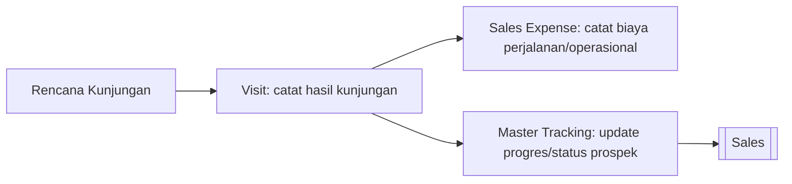

# 🤝 CRM (Customer Relationship Management)

⬅️ [[0. Index]]

## Ringkasan
Modul untuk tim sales mencatat aktivitas kunjungan ke pelanggan, biaya operasional sales, dan pelacakan target/progres sales.

## Daftar Sub-Menu

| Sub-Menu | URL | Hak Akses | Fungsi |
|---|---|---|---|
| Visit | `/admin/visit` | `read-visit` | Mencatat kunjungan sales ke customer/prospek |
| Sales Expense | `/admin/sales-expense` | `read-sales-expense` | Mencatat biaya operasional selama kunjungan sales |
| Master Tracking | `/admin/master-tracking` | `read-master-tracking` | Melacak progres/target aktivitas sales |

## Alur Kerja

---

## 1. Visit
**Fungsi:** Mencatat setiap kunjungan sales ke pelanggan/prospek (tanggal, tujuan, hasil kunjungan).

**Langkah Umum:**
1. Buka **CRM > Visit**.
2. Klik **Tambah Kunjungan**, pilih customer (dari [[2. Master-Data#Vendor & Customer|Master Data]]), isi jenis kunjungan (lihat Visit Type di Master Data), tanggal, dan catatan hasil.
3. Simpan.

## 2. Sales Expense
**Fungsi:** Mencatat pengeluaran operasional sales terkait kunjungan (transport, entertain, dll).

**Langkah Umum:**
1. Buka **CRM > Sales Expense**.
2. Tambah pengeluaran, kaitkan dengan kunjungan terkait jika ada, isi nominal & kategori biaya.
3. Simpan — biasanya perlu approval lewat [[10. Approval-Request|Permintaan Persetujuan]].

## 3. Master Tracking
**Fungsi:** Melacak status/progres prospek atau target penjualan dari tiap sales.

**Langkah Umum:**
1. Buka **CRM > Master Tracking**.
2. Lihat/atur status progres per prospek/customer.
3. Update status sesuai tahap (misal: Prospek → Negosiasi → Deal).

## Keterkaitan dengan Modul Lain
Prospek yang sudah "Deal" di Master Tracking biasanya lanjut menjadi transaksi resmi di [[4. Sales|Penjualan]] (Quotation/Sales Order). 🔗
