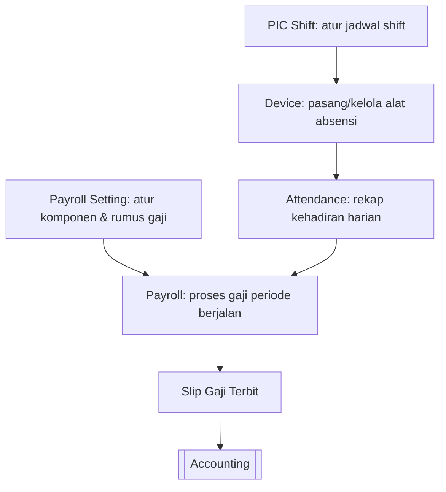

# 👥 HR (Human Resources)

⬅️ [[0. Index]]

## Ringkasan
Modul HR mengelola presensi (kehadiran) karyawan, jadwal shift, hingga proses penggajian (payroll) secara terintegrasi.

## Alur Kerja Modul HR

## Daftar Sub-Menu

| Sub-Menu | URL | Hak Akses | Fungsi |
|---|---|---|---|
| Device *(bagian dari Presence)* | `/admin/device` | `read-device` | Mengelola alat/mesin presensi yang terhubung ke sistem |
| Attendance *(bagian dari Presence)* | `/admin/attendance` | `read-attendance` | Mencatat & memantau kehadiran karyawan |
| Payroll | `/admin/payroll` | `read-payroll` | Memproses penggajian karyawan per periode |
| PIC Shift | `/admin/pic-shift` | `read-pic-shift` | Mengatur PIC/jadwal shift kerja karyawan |
| Payroll Setting | `/admin/payroll-setting` | `read-payroll-setting` | Mengatur komponen & formula perhitungan gaji |

---

## 1. Presence > Device
**Fungsi:** Mendaftarkan dan mengelola perangkat/mesin absensi (misal fingerprint) yang digunakan untuk mencatat kehadiran.

**Langkah Umum:**
1. Buka **HR > Kehadiran > Device**.
2. Klik **Tambah** untuk mendaftarkan mesin absensi baru (isi nama, serial number, lokasi).
3. Simpan — device siap mengirim data kehadiran ke sistem.

🔒 Hak akses: `read-device`

---

## 2. Presence > Attendance
**Fungsi:** Menampilkan dan mengelola data kehadiran harian karyawan.

**Langkah Umum:**
1. Buka **HR > Kehadiran > Absensi**.
2. Lihat daftar kehadiran (tanggal, jam masuk/pulang).
3. Gunakan filter tanggal/karyawan untuk mencari data tertentu.

🔒 Hak akses: `read-attendance`
⚠️ Data ini menjadi dasar perhitungan di [[13. HR#3. Payroll|Payroll]] — pastikan lengkap sebelum akhir periode.

---

## 3. Payroll
**Fungsi:** Memproses gaji karyawan berdasarkan data Attendance, PIC Shift, dan aturan dari Payroll Setting.

**Langkah Umum:**
1. Buka **HR > Penggajian**.
2. Klik **Tambah** — untuk menghitung otomatis berdasarkan kehadiran & komponen gaji (isi pekerja, period start, periode end, periode).
3. Cetak/kirim slip gaji.

🔒 Hak akses: `read-payroll`

---

## 4. PIC Shift
**Fungsi:** Mengatur penanggung jawab (PIC) dan jadwal shift kerja karyawan.

**Langkah Umum:**
1. Buka **HR > Pekerja Shift**.
2. Atur jadwal shift per karyawan/departemen (Pagi/Siang/Malam).
3. Tetapkan PIC yang bertanggung jawab atas shift tersebut jika ada fitur ini.
4. Simpan — jadwal ini menjadi acuan perhitungan keterlambatan/lembur di Attendance.

🔒 Hak akses: `read-pic-shift`

---

## 5. Payroll Setting
**Fungsi:** Mengatur komponen gaji (gaji pokok, tunjangan, potongan, lembur, dll) dan formula perhitungannya.

**Langkah Umum:**
1. Buka **HR > Pengaturan Penggajian**.
2. Atur/tambah komponen gaji yang berlaku.
3. Tentukan formula perhitungan otomatis (jika tersedia).
4. Simpan — pengaturan ini otomatis dipakai saat [[13. HR#3. Payroll|Payroll]] diproses.

🔒 Hak akses: `read-payroll-setting`
⚠️ Perubahan di sini berdampak ke seluruh perhitungan gaji berikutnya — sebaiknya hanya diakses HRD/Admin.

---

## Keterkaitan dengan Modul Lain
- Hasil Payroll biasanya tercatat sebagai beban di [[8. Accounting|Akuntansi]] (jurnal otomatis).
- Data kehadiran & shift murni internal modul HR, tidak terhubung langsung ke modul lain.

## FAQ
**Q: Apa yang terjadi jika data Attendance belum lengkap saat Payroll diproses?**
A: Jika data attendance belum lengkap maka payroll tidak bisa di proses

**Q: Bisakah PIC Shift diubah setelah data Attendance sudah masuk?**
A: Shift bisa dibuat setelah data attendance sudah masuk
