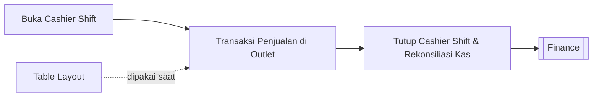

# 🧾 POS (Point of Sale)

⬅️ [[0. Index]]

## Ringkasan
Modul untuk operasional kasir di outlet: mengatur shift kasir dan layout meja (untuk bisnis resto/kafe).

## Daftar Sub-Menu

| Sub-Menu | URL | Hak Akses | Fungsi |
|---|---|---|---|
| Cashier Shift | `/admin/cashier-shift` | *(tidak diset)* | Membuka/menutup shift kasir, rekap transaksi per shift |
| Table Layout | `/admin/table-layout` | `read-table` | Mengatur denah/layout meja outlet |

## Alur Kerja

---

## 1. Cashier Shift
**Fungsi:** Mengelola sesi kerja kasir — dari buka shift (setor modal awal) hingga tutup shift (rekonsiliasi kas akhir).

**Langkah Umum:**
1. Buka **POS > Cashier Shift**.
2. ✅ **Buka Shift Baru**: input modal awal kas, lalu mulai sesi.
3. Selama shift berjalan, transaksi penjualan tercatat otomatis ke sesi ini.
4. Di akhir shift, klik **Tutup Shift**: sistem menampilkan total transaksi vs kas fisik untuk direkonsiliasi.
5. Simpan hasil tutup shift.

⚠️ Karena permission-nya kosong, kemungkinan menu ini bisa diakses semua role kasir tanpa perlu izin khusus — perlu dicek kembali ke tim IT.

---

## 2. Table Layout
**Fungsi:** Mengatur denah meja untuk bisnis F&B (resto/kafe), agar kasir bisa memilih meja saat input pesanan.

**Langkah Umum:**
1. Buka **POS > Table Layout**.
2. Atur posisi/nomor meja sesuai denah outlet.
3. Simpan — layout ini dipakai saat transaksi di Cashier Shift untuk memilih meja pelanggan.

🔒 Hak akses: `read-table`

## Keterkaitan dengan Modul Lain
- Data master meja diambil dari [[2. Master-Data#Table|Master Data > Table]].
- Hasil transaksi kasir masuk ke pencatatan [[7. Finance|Keuangan]].
