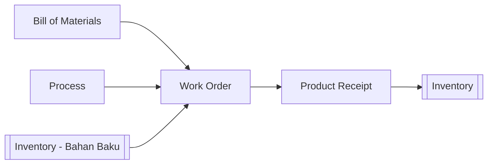

# 🏭 Produksi (Production)

⬅️ [[0. Index]]

## Ringkasan
Modul untuk mengelola proses produksi/manufaktur — dari definisi proses & bahan baku, perintah kerja produksi, hingga hasil produk jadi masuk ke stok.

## Alur Kerja

## Daftar Sub-Menu

| Sub-Menu | URL | Hak Akses | Fungsi |
|---|---|---|---|
| Process | `/admin/process` | `read-process` | Definisi tahapan/alur proses produksi |
| Bill of Materials | `/admin/bill-of-material` | `read-bill-of-material` | Daftar bahan baku yang dibutuhkan untuk 1 produk jadi (resep produksi) |
| Work Order | `/admin/work-order` | `read-work-order` | Perintah kerja produksi |
| Product Receipt | `/admin/product-receipt` | `read-product-receipt` | Penerimaan hasil produk jadi dari produksi |

---

## 1. Process
**Fungsi:** Mendefinisikan tahapan proses produksi (misal: Pemotongan → Perakitan → Finishing).

**Langkah Umum:**
1. Buka **Produksi > Process**.
2. Tambah proses baru, urutkan tahapannya.
3. Simpan.

## 2. Bill of Materials (BOM)
**Fungsi:** Menentukan "resep" — bahan baku apa saja dan berapa banyak yang dibutuhkan untuk menghasilkan 1 unit produk jadi.

**Langkah Umum:**
1. Buka **Produksi > Bill of Materials**.
2. Pilih produk jadi (dari [[2. Master-Data#Item/Service|Master Data]]), tambahkan daftar bahan baku & kuantitas per unit.
3. Simpan.

⚠️ BOM harus akurat karena menjadi dasar perhitungan kebutuhan bahan baku saat Work Order dibuat.

## 3. Work Order (WO)
**Fungsi:** Perintah kerja resmi untuk memulai produksi sejumlah produk tertentu.

**Langkah Umum:**
1. Buka **Produksi > Work Order**.
2. Buat WO baru, pilih produk & kuantitas yang akan diproduksi, sistem otomatis menghitung kebutuhan bahan baku dari BOM.
3. Konfirmasi ketersediaan bahan baku di [[6. Inventory|Inventaris]].
4. Jalankan produksi sesuai Process yang ditentukan.

## 4. Product Receipt
**Fungsi:** Mencatat hasil produk jadi dari Work Order yang selesai.

**Langkah Umum:**
1. Buka **Produksi > Product Receipt**.
2. Pilih WO terkait, input jumlah produk jadi yang dihasilkan (termasuk jika ada barang cacat/reject).
3. Simpan — stok produk jadi otomatis bertambah, dan bahan baku otomatis berkurang di [[6. Inventory|Inventaris]].

## Keterkaitan dengan Modul Lain
- Bahan baku diambil dari stok [[6. Inventory|Inventaris]].
- Hasil produksi (produk jadi) masuk kembali ke stok [[6. Inventory|Inventaris]], siap dijual lewat [[4. Sales|Penjualan]].
