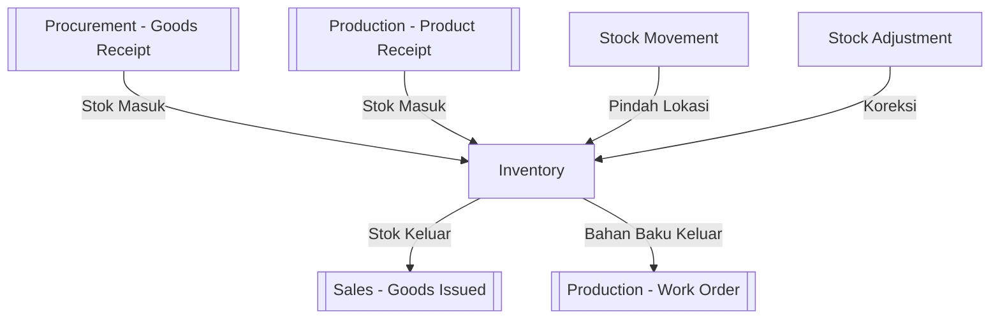

# 📦 Inventaris (Inventory)

⬅️ [[0. Index]]

## Ringkasan
Modul untuk memantau dan mengelola pergerakan serta penyesuaian stok barang di semua lokasi/gudang, plus laporan stok.

## Daftar Sub-Menu

| Sub-Menu | URL | Hak Akses | Fungsi |
|---|---|---|---|
| Stock Movement | `/admin/stock-movement` | `read-stock-movement` | Mutasi/perpindahan stok antar lokasi |
| Stock Adjustment | `/admin/stock-adjustment` | `read-stock-adjustment` | Penyesuaian stok (koreksi selisih fisik vs sistem) |
| Report > Item Stock | `/admin/item-stock` | `read-item-stock` | Laporan posisi stok saat ini per item |
| Report > Item Transaction | `/admin/item-transaction` | `read-item-transaction` | Laporan histori transaksi keluar-masuk per item |

## Alur Stok Barang (Gambaran Besar)

---

## 1. Stock Movement
**Fungsi:** Mencatat perpindahan stok dari satu lokasi/gudang ke lokasi lain (misal dari Gudang Pusat ke Cabang).

**Langkah Umum:**
1. Buka **Inventaris > Stock Movement**.
2. Pilih item, lokasi asal, dan lokasi tujuan ([[2. Master-Data#Location|Master Data]]).
3. Input kuantitas yang dipindahkan.
4. Simpan — stok otomatis berkurang di lokasi asal dan bertambah di lokasi tujuan.

## 2. Stock Adjustment
**Fungsi:** Menyesuaikan jumlah stok sistem agar sesuai dengan hasil stok opname/fisik.

**Langkah Umum:**
1. Buka **Inventaris > Stock Adjustment**.
2. Pilih item & lokasi, input jumlah aktual hasil pengecekan fisik.
3. Sistem menghitung selisih dan mencatatnya sebagai penyesuaian (tambah/kurang).
4. ✅ Simpan — biasanya perlu approval jika selisihnya signifikan.

⚠️ Gunakan fitur ini hati-hati — hanya untuk koreksi berdasarkan pengecekan fisik nyata, bukan untuk manipulasi stok.

## 3. Report — Item Stock
**Fungsi:** Melihat posisi stok terkini semua item di semua lokasi.

**Langkah Umum:**
1. Buka **Inventaris > Report > Item Stock**.
2. Filter berdasarkan lokasi/kategori item jika perlu.
3. Export ke Excel/PDF jika dibutuhkan untuk laporan.

## 4. Report — Item Transaction
**Fungsi:** Melihat histori lengkap keluar-masuk stok suatu item (untuk audit/tracing).

**Langkah Umum:**
1. Buka **Inventaris > Report > Item Transaction**.
2. Pilih item & rentang tanggal.
3. Sistem menampilkan semua transaksi yang mempengaruhi stok item tersebut (dari Goods Receipt, Goods Issued, Stock Movement, Adjustment, dll).

## Keterkaitan dengan Modul Lain
Inventory adalah "pusat" pergerakan stok yang terhubung ke [[3. Procurement|Pengadaan]] (stok masuk dari pembelian), [[4. Sales|Penjualan]] (stok keluar dari penjualan), dan [[5. Production|Produksi]] (bahan baku keluar, produk jadi masuk).
