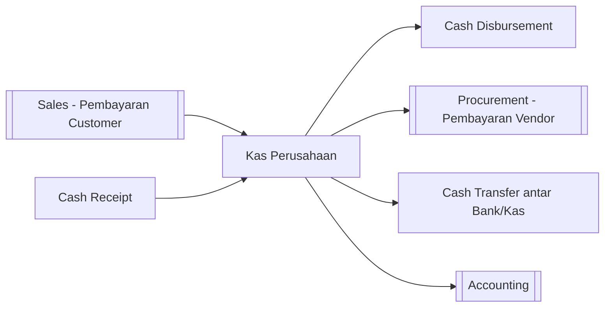

# 💵 Keuangan (Finance)

⬅️ [[0. Index]]

## Ringkasan
Modul untuk mencatat pergerakan kas perusahaan — penerimaan kas, pengeluaran kas, dan transfer antar rekening/kas.

⚠️ Catatan: Berdasarkan data navigasi, menu **Faktur Pembelian/Pembayaran** dan **Faktur Penjualan/Pembayaran** sebenarnya berada di modul [[3. Procurement|Pengadaan]] dan [[4. Sales|Penjualan]]. Modul Finance di sini fokus pada transaksi kas langsung.

## Daftar Sub-Menu

| Sub-Menu | URL | Hak Akses | Fungsi |
|---|---|---|---|
| Cash Receipt | `/admin/cash-receipt` | `read-cash-receipt` | Mencatat penerimaan kas (di luar pembayaran piutang customer) |
| Cash Disbursement | `/admin/cash-disbursement` | `read-cash-disbursement` | Mencatat pengeluaran kas (biaya operasional, dll) |
| Cash Transfer | `/admin/cash-transfer` | `read-cash-transfer` | Mencatat perpindahan dana antar kas/rekening bank |

## Alur Kerja

---

## 1. Cash Receipt
**Fungsi:** Mencatat penerimaan uang masuk yang bukan dari pembayaran piutang customer biasa (misal: modal masuk, pendapatan lain-lain).

**Langkah Umum:**
1. Buka **Keuangan > Cash Receipt**.
2. Pilih akun kas/bank tujuan ([[2. Master-Data#Bank|Master Data]]), isi sumber & nominal penerimaan.
3. Simpan.

## 2. Cash Disbursement
**Fungsi:** Mencatat pengeluaran kas untuk kebutuhan operasional (di luar pembayaran ke vendor lewat modul Pengadaan).

**Langkah Umum:**
1. Buka **Keuangan > Cash Disbursement**.
2. Pilih akun kas/bank sumber, isi tujuan pengeluaran & nominal.
3. ✅ Simpan — mungkin perlu approval tergantung nominal (lihat [[10. Approval-Request]]).

## 3. Cash Transfer
**Fungsi:** Mencatat perpindahan dana antar rekening/kas internal perusahaan (misal dari Bank A ke Bank B, atau dari Kas Kecil ke Bank).

**Langkah Umum:**
1. Buka **Keuangan > Cash Transfer**.
2. Pilih akun sumber dan akun tujuan, isi nominal transfer.
3. Simpan.

## Keterkaitan dengan Modul Lain
Semua transaksi di modul ini (dan pembayaran dari [[3. Procurement|Pengadaan]] & [[4. Sales|Penjualan]]) akan tercatat sebagai jurnal otomatis di [[8. Accounting|Akuntansi]]. 🔗
