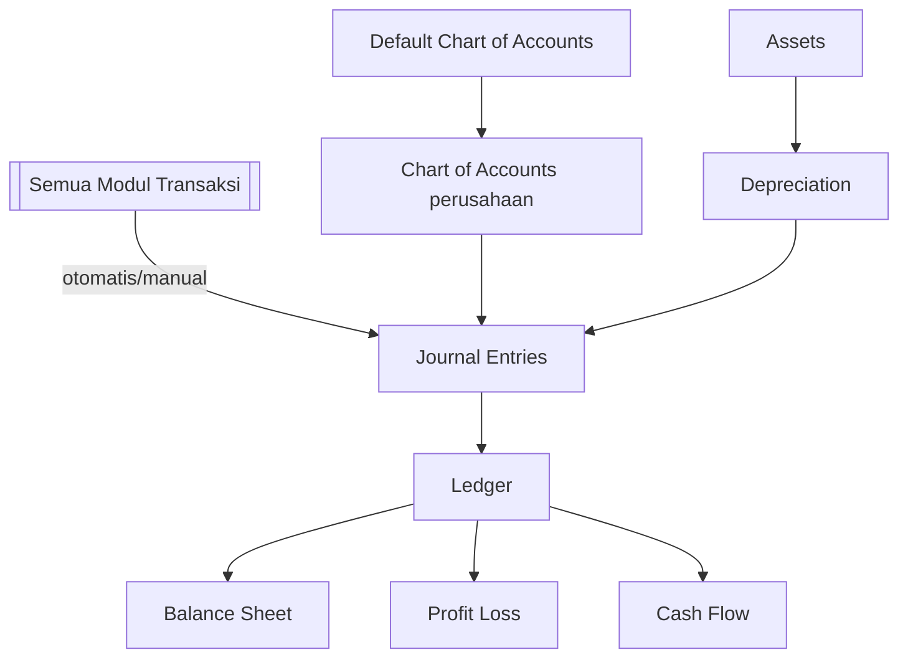

# 📚 Akuntansi (Accounting)

⬅️ [[0. Index]]

## Ringkasan
Modul pencatatan akuntansi resmi perusahaan — bagan akun, jurnal, aset tetap & penyusutan, hingga laporan keuangan. Modul ini menjadi "muara" dari hampir semua transaksi di modul-modul lain.

## Alur Kerja

## Daftar Sub-Menu

| Sub-Menu | URL | Hak Akses | Fungsi |
|---|---|---|---|
| Chart of Accounts | `/admin/chart-of-account` | `read-chart-of-account` | Daftar akun akuntansi perusahaan |
| Default Chart of Accounts | `/admin/default-chart-of-account` | `read-default-chart-of-account` | Template/akun bawaan sistem |
| Journal Entries | `/admin/journal` | `read-journal` | Pencatatan jurnal transaksi |
| **Fixed Assets** > Asset Type | `/admin/asset-type` | `read-asset-type` | Kategori aset tetap |
| **Fixed Assets** > Assets | `/admin/asset` | `read-asset` | Data aset tetap perusahaan |
| **Report** > Ledger | `/admin/ledger` | `read-ledger` | Buku besar |
| **Report** > Balance Sheet | `/admin/balance-sheet` | `read-balance-sheet` | Neraca |
| **Report** > Profit Loss | `/admin/profit-loss` | `read-profit-loss` | Laporan laba rugi |
| **Report** > Cash Flow | `/admin/cash-flow` | `read-cash-flow` | Laporan arus kas |

---

## 1. Chart of Accounts (CoA)
**Fungsi:** Menyusun daftar akun (kas, piutang, utang, pendapatan, beban, dll) sebagai dasar seluruh pencatatan keuangan.

**Langkah Umum:**
1. Buka **Akuntansi > Chart of Accounts**.
2. Bisa mulai dari **Default Chart of Accounts** (template bawaan sistem) lalu disesuaikan, atau buat manual.
3. Tambah/edit akun sesuai kebutuhan (kode akun, nama, tipe akun).

⚠️ CoA sebaiknya disusun di awal implementasi sistem dan tidak sering diubah struktur utamanya.

## 2. Journal Entries
**Fungsi:** Mencatat jurnal transaksi — baik otomatis dari modul lain (Sales, Procurement, Payroll, dll) maupun manual (misal jurnal penyesuaian).

**Langkah Umum:**
1. Buka **Akuntansi > Journal Entries**.
2. Lihat jurnal otomatis yang sudah tercatat dari transaksi modul lain.
3. Untuk jurnal manual: klik **Tambah Jurnal**, isi akun debit-kredit, pastikan seimbang (balance).
4. Simpan.

## 3. Fixed Assets (Aset Tetap)
**Fungsi:** Mencatat aset tetap perusahaan (bangunan, kendaraan, mesin) dan menghitung penyusutannya.

**Langkah Umum:**
1. **Asset Type**: buat kategori aset dulu (misal: Kendaraan, Peralatan Kantor).
2. **Assets**: tambah aset baru, pilih tipe, isi nilai perolehan, tanggal beli, masa manfaat.
3. Sistem menghitung penyusutan (depreciation) otomatis sesuai metode yang berlaku, dan mencatatnya ke Journal Entries secara berkala.

## 4. Report (Laporan Keuangan)
**Fungsi:** Menampilkan laporan keuangan standar berdasarkan data jurnal yang sudah tercatat.

| Laporan | Kegunaan |
|---|---|
| Ledger (Buku Besar) | Melihat detail mutasi tiap akun |
| Balance Sheet (Neraca) | Melihat posisi aset, liabilitas, dan ekuitas per tanggal tertentu |
| Profit Loss (Laba Rugi) | Melihat pendapatan vs beban dalam periode tertentu |
| Cash Flow (Arus Kas) | Melihat pergerakan kas masuk-keluar dalam periode tertentu |

**Langkah Umum:**
1. Buka **Akuntansi > Report**, pilih jenis laporan.
2. Tentukan rentang periode/tanggal.
3. Generate — export ke PDF/Excel jika perlu.

## Keterkaitan dengan Modul Lain
Modul Akuntansi menerima jurnal otomatis dari [[3. Procurement|Pengadaan]], [[4. Sales|Penjualan]], [[7. Finance|Keuangan]], [[13. HR]] (payroll), dan [[14. POS]]. Semua laporan keuangan disusun berdasarkan akumulasi data dari modul-modul tersebut.
