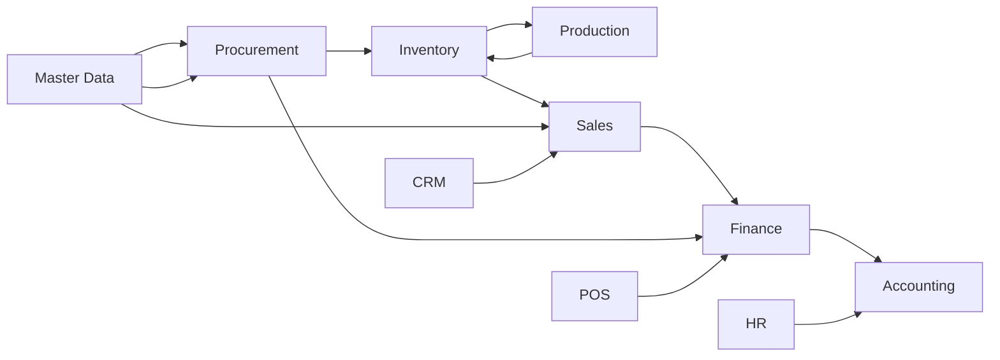

---
tags:
  - erp
  - dokumentasi
  - index
share_link: https://share.note.sx/07k4bpit#TmT1deZ3HQm9JcqkjWm/Bg
share_updated: 2026-07-01T11:28:30+07:00
---

# 📘 Dokumentasi Aplikasi ERP

Selamat datang di dokumentasi aplikasi ERP. Dokumen ini disusun untuk membantu pengguna memahami **fungsi tiap modul** dan **alur kerja antar modul**, bukan sekadar daftar menu.

> 💡 Cara pakai: buka folder ini sebagai *Vault* baru di Obsidian, lalu mulai dari halaman ini. Klik link biru untuk berpindah ke halaman modul terkait.

---

## 🗺️ Peta Alur Bisnis Utama

Diagram ini menunjukkan bagaimana modul-modul saling terhubung dalam satu siklus bisnis (dari pembelian barang sampai laporan keuangan):

**Penjelasan singkat:**
- **Master Data** adalah fondasi (data vendor, item, lokasi, dll) yang dipakai hampir semua modul lain.
- **Procurement** (pembelian) menghasilkan barang masuk ke **Inventory**.
- **Production** mengambil bahan dari Inventory dan menghasilkan produk jadi kembali ke Inventory.
- **Sales** (penjualan) mengeluarkan barang dari Inventory dan menghasilkan piutang di **Finance**.
- **Finance** mencatat semua transaksi kas/piutang/utang, lalu bermuara ke **Accounting** sebagai jurnal & laporan keuangan.
- **HR** (payroll) dan **POS** (kasir) juga berkontribusi ke Finance/Accounting.

---

## 📂 Daftar Modul

### Operasional Harian
- [[Dashboard]]
- [[Approval-Request|Permintaan Persetujuan]]
- [[HR]]
- [[POS]]
- [[CRM]]
- [[Content]]

### Data Master
- [[Master-Data]]

### Siklus Transaksi (Procure-to-Pay & Order-to-Cash)
- [[Procurement|Pengadaan]]
- [[Sales|Penjualan]]
- [[Production|Produksi]]
- [[Inventory|Inventaris]]

### Keuangan
- [[Finance|Keuangan]]
- [[Accounting|Akuntansi]]

### Administrasi Sistem
- [[Settings|Pengaturan]]

---

## 🔑 Tentang Hak Akses (Permission)

Setiap menu punya kode *permission* (misal `read-payroll`) yang menentukan siapa saja yang boleh mengakses menu tersebut. Kode ini ditulis di tiap halaman modul pada bagian **"Hak Akses"**. Jika user tidak melihat suatu menu, kemungkinan besar role-nya belum diberi permission terkait — hubungi Admin/Settings > Authorization.

---

## 🏷️ Legenda Simbol

| Simbol | Arti |
|---|---|
| 🔗 | Link ke modul/halaman lain |
| ⚠️ | Catatan penting/hati-hati |
| 🔒 | Butuh hak akses khusus |
| ✅ | Langkah wajib |
