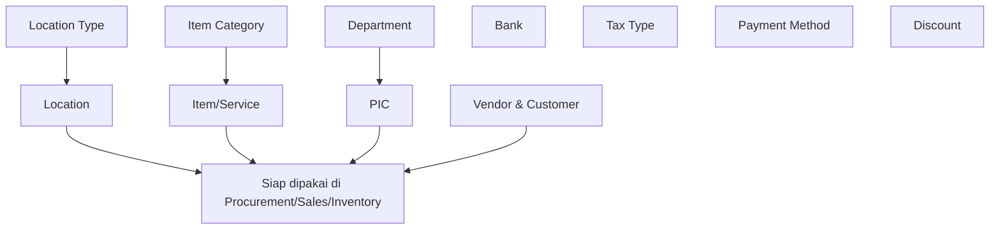

# 🗄️ Master Data

⬅️ [[Home]]

## Ringkasan
Modul ini berisi **semua data dasar/referensi** yang dipakai oleh modul-modul transaksi lain (Procurement, Sales, Inventory, dll). Modul ini wajib diisi lebih dulu sebelum modul transaksi bisa digunakan dengan benar.

⚠️ **Isi Master Data dengan urutan yang tepat** — beberapa data saling bergantung (misal: Item Category harus ada dulu sebelum bisa menambah Item).

## Daftar Sub-Menu

| Sub-Menu | URL | Hak Akses | Fungsi |
|---|---|---|---|
| [Bank](#1-bank) | `/admin/bank` | `read-bank` | Data rekening bank perusahaan |
| [Department](#2-department) | `/admin/department` | `read-department` | Data departemen/divisi internal |
| [Vendor & Customer](#3-vendor--customer) | `/admin/vendor` | `read-vendor` | Data supplier & pelanggan |
| [PIC](#4-pic) | `/admin/pic` | `read-pic` | Data penanggung jawab (person in charge) |
| [Visit Type](#5-visit-type) | `/admin/visit-type` | `read-visit-type` | Jenis-jenis kunjungan sales (untuk [[CRM]]) |
| [Vehicle Type](#6-vehicle-type) | `/admin/vehicle-type` | `read-vehicle-type` | Jenis kendaraan (untuk pengiriman/operasional) |
| [Member](#7-member) | `/admin/member` | `read-member` | Data member/pelanggan loyalti |
| [Location Type](#8-location-type) | `/admin/location-type` | `read-location-type` | Jenis lokasi (gudang, outlet, dll) |
| [Location](#9-location) | `/admin/location` | `read-location` | Data lokasi fisik (gudang, cabang) |
| [Cost](#10-cost) | `/admin/cost` | `read-cost` | Data jenis biaya |
| [Item Category](#11-item-category) | `/admin/item-category` | `read-item-category` | Kategori barang/jasa |
| [Item/Service](#12-itemservice) | `/admin/item` | `read-item` | Data barang & jasa yang diperjualbelikan |
| [Tax Type](#13-tax-type) | `/admin/type-of-tax` | `read-tax-type` | Jenis pajak (PPN, dll) |
| [Payment Method](#14-payment-method) | `/admin/payment-method` | `read-payment-method` | Metode pembayaran yang tersedia |
| [Discount](#15-discount) | `/admin/discount` | `read-discount` | Data diskon/promo |
| [Room](#16-room) | `/admin/room` | `read-room` | Data ruangan (untuk bisnis hotel/venue) |
| [Table](#17-table) | `/admin/table` | `read-table` | Data meja (untuk [[POS]]) |

## Urutan Pengisian yang Disarankan

## Pola Umum CRUD (berlaku di hampir semua sub-menu)

| Aksi            | Langkah Umum                                                                                                                |
| --------------- | --------------------------------------------------------------------------------------------------------------------------- |
| **Tambah**      | Klik tombol **+ Tambah Data** → isi form → klik **Simpan**                                                                  |
| **Ubah**        | Klik ikon ![[Pasted image 20260710094609.png]] (edit) pada baris data → ubah field yang diperlukan → klik **Simpan/Update** |
| **Hapus**       | Klik ikon 🗑️ (delete) pada baris data → konfirmasi **Ya, Hapus** pada dialog konfirmasi                                    |
| **Filter/Cari** | Gunakan kolom pencarian (search box) dan/atau dropdown filter di atas tabel → hasil otomatis/klik **Terapkan/Cari**         |

⚠️ Data yang **sudah dipakai** di transaksi lain (misal Item yang sudah ada di Sales Order) biasanya **tidak bisa dihapus** — sistem akan menampilkan pesan error atau menonaktifkan tombol hapus. Alternatifnya, gunakan status **Nonaktif/Inactive** jika tersedia.

---

## 1. Bank
**Fungsi:** Data rekening bank perusahaan, dipakai di [[Finance|Keuangan]] & pembayaran.

- **Tambah:** Buka **Master Data > Bank** → **+ Tambah Bank** → isi Kode (di isi manual/generate otomatis), Nama dan Icon → **Simpan**.
- **Ubah:** Klik icon dropdown ![[Pasted image 20260707135504.png]] pada baris dan klik ![[Pasted image 20260707135352.png|24]] ubah Kode, Nama dan Icon → **Simpan**.
- **Hapus:** Klik icon dropdown ![[Pasted image 20260707135504.png]]pada baris dan Klik ![[Pasted image 20260707135742.png|24]] muncul pop up → Hapus data. Apakah Anda yakin untuk Hapus Bank: Bank Negara Indonesia? → **OK**.
- **Pulihkan:** Buka daftar **Arsip** → klik dropdown (⋮) pada baris bank → klik **Pulihkan**.
- **Hapus Selamanya:** Buka daftar **Arsip** → klik dropdown (⋮) pada baris bank → klik **Hapus Selamanya** → konfirmasi.
- **Filter:** Cari berdasarkan nama bank atau nomor rekening di search box.

---

## 2. Department
**Fungsi:** Data departemen/divisi internal, dipakai untuk mengelompokkan karyawan/PIC.

- **Tambah:** **Master Data > Department** → **+ Tambah Department** → isi Nama, Kode (generate otomatis) → **Simpan**.
- **Ubah:** Klik icon dropdown ![[Pasted image 20260707135504.png]] pada baris dan klik ![[Pasted image 20260707135352.png|24]] ubah nama → **Simpan**.
- **Hapus:** Klik icon ![[Pasted image 20260707135504.png]]di list dan Klik ![[Pasted image 20260707135742.png]] muncul pop up → Hapus. Apakah Anda yakin untuk Hapus Departemen → **OK**.
- **Pulihkan:** Buka daftar **Arsip** → klik dropdown (⋮) pada baris bank → klik **Pulihkan**.
- **Hapus Selamanya:** Buka daftar **Arsip** → klik dropdown (⋮) pada baris bank → klik **Hapus Selamanya** → konfirmasi.
- **Filter:** Cari berdasarkan nama department.

---

## 3. Vendor & Customer
**Fungsi:** Data supplier (vendor) dan pelanggan (customer), dipakai di [[Procurement|Pengadaan]], [[Sales|Penjualan]], [[CRM]].

- **Tambah:** **Master Data > Vendor & Customer** → **+ Tambah** → pilih tipe (Vendor/Customer/Keduanya) → isi Nama, Alamat, Kontak (telp/email), NPWP (jika ada), Termin Pembayaran → **Simpan**.- **Ubah:** Klik icon dropdown ![[Pasted image 20260707135504.png]] pada baris dan klik ![[Pasted image 20260707135352.png|24]] ubah nama → **Simpan**.
- **Hapus:** Klik icon ![[Pasted image 20260707135504.png]]di list dan Klik ![[Pasted image 20260707135742.png]] muncul pop up → Hapus. Apakah Anda yakin untuk Hapus Departemen → **OK**.
- **Pulihkan:** Buka daftar **Arsip** → klik dropdown (⋮) pada baris bank → klik **Pulihkan**.
- **Hapus Selamanya:** Buka daftar **Arsip** → klik dropdown (⋮) pada baris bank → klik **Hapus Selamanya** → konfirmasi.
- **Filter:** Filter berdasarkan tipe (Vendor/Customer), atau cari berdasarkan nama/kontak.

---

## 4. PIC
**Fungsi:** Data penanggung jawab (person in charge), biasanya terhubung ke Department dan dipakai di [[CRM]]/[[Procurement|Pengadaan]].

- **Tambah:** **Master Data > PIC** → **+ Tambah PIC** → isi Nama, Department (pilih dari data Department), Jabatan, Kontak → **Simpan**.
- **Ubah:** Klik icon dropdown ![[Pasted image 20260707135504.png]] pada baris dan klik ![[Pasted image 20260707135352.png|24]] ubah nama → **Simpan**.
- **Hapus:** Klik icon ![[Pasted image 20260707135504.png]]di list dan Klik ![[Pasted image 20260707135742.png]] muncul pop up → Hapus. Apakah Anda yakin untuk Hapus Departemen → **OK**.
- **Pulihkan:** Buka daftar **Arsip** → klik dropdown (⋮) pada baris bank → klik **Pulihkan**.
- **Hapus Selamanya:** Buka daftar **Arsip** → klik dropdown (⋮) pada baris bank → klik **Hapus Selamanya** → konfirmasi.
- **Filter:** Filter berdasarkan Department, atau cari nama PIC.

---

## 5. Visit Type
**Fungsi:** Jenis-jenis kunjungan sales (misal: Kunjungan Rutin, Follow Up, Penagihan), dipakai di [[CRM#1. Visit|CRM > Visit]].

- **Tambah:** **Master Data > Visit Type** → **+ Tambah** → isi Nama Jenis Kunjungan, Deskripsi (opsional) → **Simpan**.
- **Ubah:** Klik icon dropdown ![[Pasted image 20260707135504.png]] pada baris dan klik ![[Pasted image 20260707135352.png|24]] ubah nama → **Simpan**.
- **Hapus:** Klik icon ![[Pasted image 20260707135504.png]]di list dan Klik ![[Pasted image 20260707135742.png]] muncul pop up → Hapus. Apakah Anda yakin untuk Hapus Departemen → **OK**.
- **Pulihkan:** Buka daftar **Arsip** → klik dropdown (⋮) pada baris bank → klik **Pulihkan**.
- **Hapus Selamanya:** Buka daftar **Arsip** → klik dropdown (⋮) pada baris bank → klik **Hapus Selamanya** → konfirmasi.
- **Filter:** Cari berdasarkan nama jenis kunjungan.

---

## 6. Vehicle Type
**Fungsi:** Jenis kendaraan operasional, dipakai di [[Sales#4. Shipping Order|Sales > Shipping Order]].

- **Tambah:** **Master Data > Vehicle Type** → **+ Tambah** → isi Nama Jenis Kendaraan (misal: Motor, Mobil Box, Truk), Kapasitas (opsional) → **Simpan**.
- **Ubah:** Klik icon dropdown ![[Pasted image 20260707135504.png]] pada baris dan klik ![[Pasted image 20260707135352.png|24]] ubah nama → **Simpan**.
- **Hapus:** Klik icon ![[Pasted image 20260707135504.png]]di list dan Klik ![[Pasted image 20260707135742.png]] muncul pop up → Hapus. Apakah Anda yakin untuk Hapus Departemen → **OK**.
- **Pulihkan:** Buka daftar **Arsip** → klik dropdown (⋮) pada baris bank → klik **Pulihkan**.
- **Hapus Selamanya:** Buka daftar **Arsip** → klik dropdown (⋮) pada baris bank → klik **Hapus Selamanya** → konfirmasi.
- **Filter:** Cari berdasarkan nama jenis kendaraan.

---

## 7. Member
**Fungsi:** Data member/pelanggan loyalti (biasanya untuk program membership/poin).

- **Tambah:** **Master Data > Member** → **+ Tambah Member** → isi Nama, No. Kartu/ID Member, Kontak, Tanggal Bergabung → **Simpan**.
- **Ubah:** Klik icon dropdown ![[Pasted image 20260707135504.png]] pada baris dan klik ![[Pasted image 20260707135352.png|24]] ubah nama → **Simpan**.
- **Hapus:** Klik icon ![[Pasted image 20260707135504.png]]di list dan Klik ![[Pasted image 20260707135742.png]] muncul pop up → Hapus. Apakah Anda yakin untuk Hapus Departemen → **OK**.
- **Pulihkan:** Buka daftar **Arsip** → klik dropdown (⋮) pada baris bank → klik **Pulihkan**.
- **Hapus Selamanya:** Buka daftar **Arsip** → klik dropdown (⋮) pada baris bank → klik **Hapus Selamanya** → konfirmasi.
- **Filter:** Cari berdasarkan nama atau nomor kartu member.

---

## 8. Location Type
**Fungsi:** Jenis lokasi (misal: Gudang, Outlet, Kantor Cabang), dasar sebelum menambah Location.

- **Tambah:** **Master Data > Location Type** → **+ Tambah** → isi Nama Jenis Lokasi → **Simpan**.
- **Ubah:** Klik icon dropdown ![[Pasted image 20260707135504.png]] pada baris dan klik ![[Pasted image 20260707135352.png|24]] ubah nama → **Simpan**.
- **Hapus:** Klik icon ![[Pasted image 20260707135504.png]]di list dan Klik ![[Pasted image 20260707135742.png]] muncul pop up → Hapus. Apakah Anda yakin untuk Hapus Departemen → **OK**.
- **Pulihkan:** Buka daftar **Arsip** → klik dropdown (⋮) pada baris bank → klik **Pulihkan**.
- **Hapus Selamanya:** Buka daftar **Arsip** → klik dropdown (⋮) pada baris bank → klik **Hapus Selamanya** → konfirmasi.
- **Filter:** Cari berdasarkan nama jenis lokasi.

---

## 9. Location
**Fungsi:** Data lokasi fisik (gudang, cabang, outlet), dipakai luas di [[Inventory|Inventaris]], [[Procurement|Pengadaan]], [[Sales|Penjualan]].

- **Tambah:** **Master Data > Location** → **+ Tambah Location** → pilih Location Type, isi Nama Lokasi, Alamat, PIC penanggung jawab (opsional) → **Simpan**.
- **Ubah:** Klik icon dropdown ![[Pasted image 20260707135504.png]] pada baris dan klik ![[Pasted image 20260707135352.png|24]] ubah nama → **Simpan**.
- **Hapus:** Klik icon ![[Pasted image 20260707135504.png]]di list dan Klik ![[Pasted image 20260707135742.png]] muncul pop up → Hapus. Apakah Anda yakin untuk Hapus Departemen → **OK**.
- **Pulihkan:** Buka daftar **Arsip** → klik dropdown (⋮) pada baris bank → klik **Pulihkan**.
- **Hapus Selamanya:** Buka daftar **Arsip** → klik dropdown (⋮) pada baris bank → klik **Hapus Selamanya** → konfirmasi.
- **Filter:** Filter berdasarkan Location Type, atau cari nama lokasi.

---

## 10. Cost
**Fungsi:** Data jenis-jenis biaya (misal: Biaya Transport, Biaya Entertain), dipakai di [[CRM#2. Sales Expense|CRM > Sales Expense]] atau [[Finance|Keuangan]].

- **Tambah:** **Master Data > Cost** → **+ Tambah** → isi Nama Jenis Biaya, Kategori (jika ada) → **Simpan**.
- **Ubah:** Klik icon dropdown ![[Pasted image 20260707135504.png]] pada baris dan klik ![[Pasted image 20260707135352.png|24]] ubah nama → **Simpan**.
- **Hapus:** Klik icon ![[Pasted image 20260707135504.png]]di list dan Klik ![[Pasted image 20260707135742.png]] muncul pop up → Hapus. Apakah Anda yakin untuk Hapus Departemen → **OK**.
- **Pulihkan:** Buka daftar **Arsip** → klik dropdown (⋮) pada baris bank → klik **Pulihkan**.
- **Hapus Selamanya:** Buka daftar **Arsip** → klik dropdown (⋮) pada baris bank → klik **Hapus Selamanya** → konfirmasi.
- **Filter:** Cari berdasarkan nama jenis biaya.

---

## 11. Item Category
**Fungsi:** Kategori barang/jasa, wajib diisi sebelum menambah data Item/Service.

- **Tambah:** **Master Data > Item Category** → **+ Tambah Kategori** → isi Nama Kategori, Kategori Induk (jika ada sub-kategori) → **Simpan**.
- **Ubah:** Klik icon dropdown ![[Pasted image 20260707135504.png]] pada baris dan klik ![[Pasted image 20260707135352.png|24]] ubah nama → **Simpan**.
- **Hapus:** Klik icon ![[Pasted image 20260707135504.png]]di list dan Klik ![[Pasted image 20260707135742.png]] muncul pop up → Hapus. Apakah Anda yakin untuk Hapus Departemen → **OK**.
- **Pulihkan:** Buka daftar **Arsip** → klik dropdown (⋮) pada baris bank → klik **Pulihkan**.
- **Hapus Selamanya:** Buka daftar **Arsip** → klik dropdown (⋮) pada baris bank → klik **Hapus Selamanya** → konfirmasi.
- **Filter:** Cari berdasarkan nama kategori, atau filter berdasarkan kategori induk.

---

## 12. Item/Service
**Fungsi:** Data barang & jasa yang diperjualbelikan/diproduksi — menu paling sering dipakai lintas modul.

- **Tambah:** **Master Data > Item/Service** → **+ Tambah Item** → pilih tipe (Barang/Jasa), Item Category, isi Nama Item, Kode/SKU, Satuan (unit), Harga Jual, Harga Beli (opsional), Stok Minimum (opsional) → **Simpan**.
- **Ubah:** Klik icon dropdown ![[Pasted image 20260707135504.png]] pada baris dan klik ![[Pasted image 20260707135352.png|24]] ubah nama → **Simpan**.
- **Hapus:** Klik icon ![[Pasted image 20260707135504.png]]di list dan Klik ![[Pasted image 20260707135742.png]] muncul pop up → Hapus. Apakah Anda yakin untuk Hapus Departemen → **OK**.
- **Pulihkan:** Buka daftar **Arsip** → klik dropdown (⋮) pada baris bank → klik **Pulihkan**.
- **Hapus Selamanya:** Buka daftar **Arsip** → klik dropdown (⋮) pada baris bank → klik **Hapus Selamanya** → konfirmasi.
- **Filter:** Filter berdasarkan Item Category atau tipe (Barang/Jasa), cari berdasarkan nama/kode item.

---

## 13. Tax Type
**Fungsi:** Jenis pajak (misal: PPN 11%, PPh), dipakai di transaksi Sales/Procurement.

- **Tambah:** **Master Data > Tax Type** → **+ Tambah** → isi Nama Pajak, Persentase Tarif → **Simpan**.
- **Ubah:** Klik icon dropdown ![[Pasted image 20260707135504.png]] pada baris dan klik ![[Pasted image 20260707135352.png|24]] ubah nama → **Simpan**.
- **Hapus:** Klik icon ![[Pasted image 20260707135504.png]]di list dan Klik ![[Pasted image 20260707135742.png]] muncul pop up → Hapus. Apakah Anda yakin untuk Hapus Departemen → **OK**.
- **Pulihkan:** Buka daftar **Arsip** → klik dropdown (⋮) pada baris bank → klik **Pulihkan**.
- **Hapus Selamanya:** Buka daftar **Arsip** → klik dropdown (⋮) pada baris bank → klik **Hapus Selamanya** → konfirmasi.
- **Filter:** Cari berdasarkan nama pajak.

---

## 14. Payment Method
**Fungsi:** Metode pembayaran yang tersedia (Tunai, Transfer, QRIS, Kartu Debit/Kredit), dipakai di [[POS]], [[Sales|Penjualan]], [[Finance|Keuangan]].

- **Tambah:** **Master Data > Payment Method** → **+ Tambah** → isi Nama Metode Pembayaran, hubungkan ke Bank (jika metode transfer) → **Simpan**.
- **Ubah:** Klik icon dropdown ![[Pasted image 20260707135504.png]] pada baris dan klik ![[Pasted image 20260707135352.png|24]] ubah nama → **Simpan**.
- **Hapus:** Klik icon ![[Pasted image 20260707135504.png]]di list dan Klik ![[Pasted image 20260707135742.png]] muncul pop up → Hapus. Apakah Anda yakin untuk Hapus Departemen → **OK**.
- **Pulihkan:** Buka daftar **Arsip** → klik dropdown (⋮) pada baris bank → klik **Pulihkan**.
- **Hapus Selamanya:** Buka daftar **Arsip** → klik dropdown (⋮) pada baris bank → klik **Hapus Selamanya** → konfirmasi.
- **Filter:** Cari berdasarkan nama metode pembayaran.

---

## 15. Discount
**Fungsi:** Data diskon/promo yang bisa diterapkan ke transaksi penjualan.

- **Tambah:** **Master Data > Discount** → **+ Tambah Diskon** → isi Nama Diskon, Tipe (Persentase/Nominal), Nilai Diskon, Periode Berlaku (tanggal mulai-selesai) → **Simpan**.
- **Ubah:** Klik icon dropdown ![[Pasted image 20260707135504.png]] pada baris dan klik ![[Pasted image 20260707135352.png|24]] ubah nama → **Simpan**.
- **Hapus:** Klik icon ![[Pasted image 20260707135504.png]]di list dan Klik ![[Pasted image 20260707135742.png]] muncul pop up → Hapus. Apakah Anda yakin untuk Hapus Departemen → **OK**.
- **Pulihkan:** Buka daftar **Arsip** → klik dropdown (⋮) pada baris bank → klik **Pulihkan**.
- **Hapus Selamanya:** Buka daftar **Arsip** → klik dropdown (⋮) pada baris bank → klik **Hapus Selamanya** → konfirmasi.
- **Filter:** Filter berdasarkan status (Aktif/Kedaluwarsa), cari nama diskon.

---

## 16. Room
**Fungsi:** Data ruangan (untuk bisnis hotel/venue/meeting room).

- **Tambah:** **Master Data > Room** → **+ Tambah Room** → isi Nama/Nomor Room, Kapasitas, Tipe Room, Lokasi terkait → **Simpan**.
- **Ubah:** Klik icon dropdown ![[Pasted image 20260707135504.png]] pada baris dan klik ![[Pasted image 20260707135352.png|24]] ubah nama → **Simpan**.
- **Hapus:** Klik icon ![[Pasted image 20260707135504.png]]di list dan Klik ![[Pasted image 20260707135742.png]] muncul pop up → Hapus. Apakah Anda yakin untuk Hapus Departemen → **OK**.
- **Pulihkan:** Buka daftar **Arsip** → klik dropdown (⋮) pada baris bank → klik **Pulihkan**.
- **Hapus Selamanya:** Buka daftar **Arsip** → klik dropdown (⋮) pada baris bank → klik **Hapus Selamanya** → konfirmasi.
- **Filter:** Filter berdasarkan Lokasi atau Tipe Room, cari nomor room.

---

## 17. Table
**Fungsi:** Data meja untuk bisnis F&B, dipakai di [[POS#2. Table Layout|POS > Table Layout]].

- **Tambah:** **Master Data > Table** → **+ Tambah Table** → isi Nomor/Nama Meja, Kapasitas (jumlah kursi), Area/Zona (jika ada) → **Simpan**.
- **Ubah:** Klik icon dropdown ![[Pasted image 20260707135504.png]] pada baris dan klik ![[Pasted image 20260707135352.png|24]] ubah nama → **Simpan**.
- **Hapus:** Klik icon ![[Pasted image 20260707135504.png]]di list dan Klik ![[Pasted image 20260707135742.png]] muncul pop up → Hapus. Apakah Anda yakin untuk Hapus Departemen → **OK**.
- **Pulihkan:** Buka daftar **Arsip** → klik dropdown (⋮) pada baris bank → klik **Pulihkan**.
- **Hapus Selamanya:** Buka daftar **Arsip** → klik dropdown (⋮) pada baris bank → klik **Hapus Selamanya** → konfirmasi.
- **Filter:** Filter berdasarkan Area/Zona, cari nomor meja.

---

## Keterkaitan dengan Modul Lain
- **Item/Service** dipakai di [[Procurement|Pengadaan]], [[Sales|Penjualan]], [[Inventory|Inventaris]], [[Production|Produksi]].
- **Vendor & Customer** dipakai di [[Procurement|Pengadaan]] (vendor) dan [[Sales|Penjualan]] & [[CRM]] (customer).
- **Table** dipakai di [[POS]].
- **Bank** & **Payment Method** dipakai di [[Finance|Keuangan]].

## Catatan Umum
⚠️ Langkah-langkah di atas mengikuti pola CRUD standar yang lazim di sistem sejenis. Nama tombol persis (misal "Tambah Data" vs "Buat Baru"), field wajib, dan aturan boleh/tidaknya hapus data **perlu dicek ulang langsung di aplikasi** dan disesuaikan.
