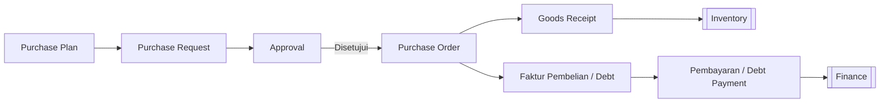

# 🛒 Pengadaan (Procurement)

⬅️ [[index]]

## Ringkasan
Modul yang mengatur seluruh siklus pembelian barang/jasa — dari perencanaan, permintaan pembelian, order ke vendor, penerimaan barang, hingga pembayaran ke vendor (siklus **Procure-to-Pay**).

## Alur Kerja (Procure-to-Pay)

## Daftar Sub-Menu

| Sub-Menu         | URL                       | Hak Akses               | Fungsi                                          |
| ---------------- | ------------------------- | ----------------------- | ----------------------------------------------- |
| Purchase Plan    | `/admin/purchase-plan`    | `read-purchase-plan`    | Rencana kebutuhan pembelian (biasanya periodik) |
| Purchase Request | `/admin/purchase-request` | `read-purchase-request` | Permintaan pembelian dari divisi/user           |
| Purchase Order   | `/admin/purchase-order`   | `read-purchase-order`   | Order resmi ke vendor                           |
| Goods Receipt    | `/admin/goods-receipt`    | `read-goods-receipt`    | Penerimaan barang dari vendor                   |
| Faktur Pembelian | `/admin/debt`             | `read-debt`             | Tagihan/utang dari vendor                       |
| Pembayaran       | `/admin/debt-payment`     | `read-debt-payment`     | Pembayaran utang ke vendor                      |

---

## A. Purchase Plan
**Fungsi:** Menyusun rencana kebutuhan barang untuk periode tertentu (bulanan/kuartalan), sebagai acuan sebelum permintaan pembelian dibuat.

**1. List dan Store:**
<iframe height="500" width="100%" src="https://www.youtube.com/embed/3uBrxJ7erWk" title="Purchase Plan List and Store" frameborder="0" allow="accelerometer; autoplay; clipboard-write; encrypted-media; gyroscope; picture-in-picture; web-share" referrerpolicy="strict-origin-when-cross-origin" allowfullscreen></iframe>

**2. Update**
<iframe height="500" width="100%" src="https://www.youtube.com/embed/4x6q9Oal-iY" title="2. Update Purchase Plan" frameborder="0" allow="accelerometer; autoplay; clipboard-write; encrypted-media; gyroscope; picture-in-picture; web-share" referrerpolicy="strict-origin-when-cross-origin" allowfullscreen></iframe>

**3. Delete**
<iframe height="500" width="100%" src="https://www.youtube.com/embed/1quI_fScumk" title="3. Delete Purchase Plan" frameborder="0" allow="accelerometer; autoplay; clipboard-write; encrypted-media; gyroscope; picture-in-picture; web-share" referrerpolicy="strict-origin-when-cross-origin" allowfullscreen></iframe>

**4. Close**
<iframe height="500" width="100%" src="https://www.youtube.com/embed/YW5PVXRpvbw" title="4.  Close Purchase Plan" frameborder="0" allow="accelerometer; autoplay; clipboard-write; encrypted-media; gyroscope; picture-in-picture; web-share" referrerpolicy="strict-origin-when-cross-origin" allowfullscreen></iframe>

**5. Restore**
<iframe height="500" width="100%" src="https://www.youtube.com/embed/1s0obFTXfkM" title="5.  Restore Purchase Plan" frameborder="0" allow="accelerometer; autoplay; clipboard-write; encrypted-media; gyroscope; picture-in-picture; web-share" referrerpolicy="strict-origin-when-cross-origin" allowfullscreen></iframe>

**6. Force Delete**
<iframe height="500" width="100%" src="https://www.youtube.com/embed/FWW8TSj-2cw" title="6.  Force Delete Purchase Plan" frameborder="0" allow="accelerometer; autoplay; clipboard-write; encrypted-media; gyroscope; picture-in-picture; web-share" referrerpolicy="strict-origin-when-cross-origin" allowfullscreen></iframe>

## 2. Purchase Request (PR)
**Fungsi:** Divisi/user mengajukan permintaan pembelian barang/jasa.

**Langkah Umum:**
1. Buka **Pengadaan > Purchase Request**.
2. Klik **Buat PR Baru**, pilih item, kuantitas, dan alasan kebutuhan.
3. Kirim untuk disetujui — PR akan muncul di [[Approval-Request|Permintaan Persetujuan]] milik atasan terkait.
4. Setelah ✅ disetujui, PR siap dilanjutkan menjadi Purchase Order.

## 3. Purchase Order (PO)
**Fungsi:** Membuat order resmi ke vendor berdasarkan PR yang sudah disetujui.

**Langkah Umum:**
1. Buka **Pengadaan > Purchase Order**.
2. Buat PO baru dari PR yang sudah disetujui, atau langsung (tergantung kebijakan perusahaan).
3. Pilih vendor ([[Master-Data#Vendor & Customer|Master Data]]), konfirmasi harga & termin pembayaran.
4. Kirim PO ke vendor (cetak/export PDF).

## 4. Goods Receipt (Penerimaan Barang)
**Fungsi:** Mencatat barang yang diterima dari vendor sesuai PO.

**Langkah Umum:**
1. Buka **Pengadaan > Goods Receipt**.
2. Pilih PO terkait, cocokkan jumlah barang fisik yang diterima dengan PO.
3. Simpan — stok otomatis bertambah di [[Inventory|Inventaris]].

⚠️ Jika barang diterima tidak sesuai PO (kurang/rusak), catat selisihnya sesuai kebijakan perusahaan.

## 5. Faktur Pembelian (Debt)
**Fungsi:** Mencatat tagihan resmi dari vendor sebagai utang usaha.

**Langkah Umum:**
1. Buka **Pengadaan > Faktur Pembelian**.
2. Buat faktur dari Goods Receipt/PO terkait, input nomor faktur vendor & jatuh tempo.
3. Simpan — akan tercatat sebagai utang di [[Finance|Keuangan]].

## 6. Pembayaran (Debt Payment)
**Fungsi:** Mencatat pembayaran utang ke vendor.

**Langkah Umum:**
1. Buka **Pengadaan > Pembayaran**.
2. Pilih faktur yang mau dibayar, isi jumlah & metode pembayaran ([[Master-Data#Payment Method|Master Data]]).
3. Simpan — status utang berubah menjadi lunas/sebagian.

## Keterkaitan dengan Modul Lain
- Goods Receipt → menambah stok di [[Inventory|Inventaris]].
- Faktur Pembelian & Pembayaran → tercatat di [[Finance|Keuangan]] dan bermuara ke [[Accounting|Akuntansi]] sebagai jurnal utang.
