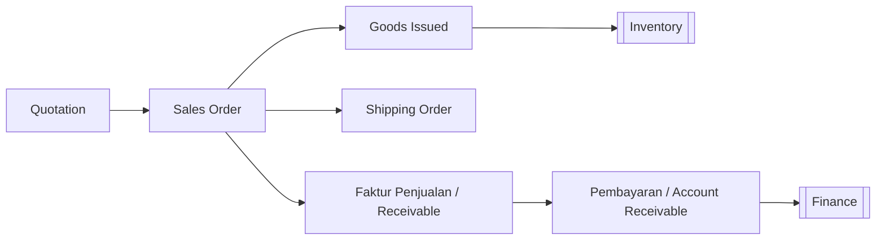

# 💰 Penjualan (Sales)

⬅️ [[index]]

## Ringkasan
Modul yang mengatur siklus penjualan — dari penawaran harga ke customer, order penjualan, pengeluaran barang, pengiriman, hingga penagihan & pembayaran dari customer (siklus **Order-to-Cash**).

## Alur Kerja (Order-to-Cash)

## Daftar Sub-Menu

| Sub-Menu | URL | Hak Akses | Fungsi |
|---|---|---|---|
| Quotation | `/admin/quotation` | `read-quotation` | Penawaran harga ke customer |
| Sales Order | `/admin/sales-order` | `read-sales-order` | Order penjualan resmi dari customer |
| Goods Issued | `/admin/goods-issued` | `read-goods-issued` | Pengeluaran barang dari gudang |
| Shipping Order | `/admin/shipping-order` | `read-shipping-order` | Perintah pengiriman barang ke customer |
| Faktur Penjualan | `/admin/receivable` | `read-receivable` | Tagihan/piutang ke customer |
| Pembayaran | `/admin/account-receivable` | `read-account-receivable` | Penerimaan pembayaran dari customer |

---

## 1. Quotation
**Fungsi:** Membuat penawaran harga untuk customer/prospek, biasanya hasil tindak lanjut dari [[CRM#1. Visit|kunjungan sales]].

**Langkah Umum:**
1. Buka **Penjualan > Quotation**.
2. Pilih customer ([[Master-Data#Vendor & Customer|Master Data]]), tambahkan item & harga.
3. Kirim penawaran ke customer.
4. Jika disetujui customer, lanjutkan menjadi Sales Order.

## 2. Sales Order (SO)
**Fungsi:** Mencatat order resmi dari customer yang siap diproses.

**Langkah Umum:**
1. Buka **Penjualan > Sales Order**.
2. Buat SO dari Quotation yang disetujui, atau langsung jika tanpa quotation.
3. Konfirmasi item, kuantitas, harga, dan tanggal pengiriman.
4. Simpan — SO siap diproses ke Goods Issued/Shipping.

## 3. Goods Issued
**Fungsi:** Mencatat pengeluaran barang dari gudang sesuai SO.

**Langkah Umum:**
1. Buka **Penjualan > Goods Issued**.
2. Pilih SO terkait, konfirmasi barang yang keluar dari gudang.
3. Simpan — stok otomatis berkurang di [[Inventory|Inventaris]].

## 4. Shipping Order
**Fungsi:** Mengatur pengiriman barang ke alamat customer.

**Langkah Umum:**
1. Buka **Penjualan > Shipping Order**.
2. Buat perintah kirim dari SO/Goods Issued, pilih kendaraan ([[Master-Data#Vehicle Type|Master Data]]) dan tujuan.
3. Simpan, cetak surat jalan jika perlu.

## 5. Faktur Penjualan (Receivable)
**Fungsi:** Menerbitkan tagihan resmi ke customer.

**Langkah Umum:**
1. Buka **Penjualan > Faktur Penjualan**.
2. Buat faktur dari SO/Goods Issued terkait, isi jatuh tempo pembayaran.
3. Simpan — tercatat sebagai piutang di [[Finance|Keuangan]].

## 6. Pembayaran (Account Receivable)
**Fungsi:** Mencatat pembayaran yang diterima dari customer.

**Langkah Umum:**
1. Buka **Penjualan > Pembayaran**.
2. Pilih faktur yang dibayar, isi jumlah & metode pembayaran.
3. Simpan — status piutang berubah menjadi lunas/sebagian.

## Keterkaitan dengan Modul Lain
- Goods Issued → mengurangi stok di [[Inventory|Inventaris]].
- Faktur Penjualan & Pembayaran → tercatat di [[Finance|Keuangan]] dan bermuara ke [[Accounting|Akuntansi]] sebagai jurnal piutang.
- Quotation biasanya hasil tindak lanjut dari [[CRM|CRM]].
